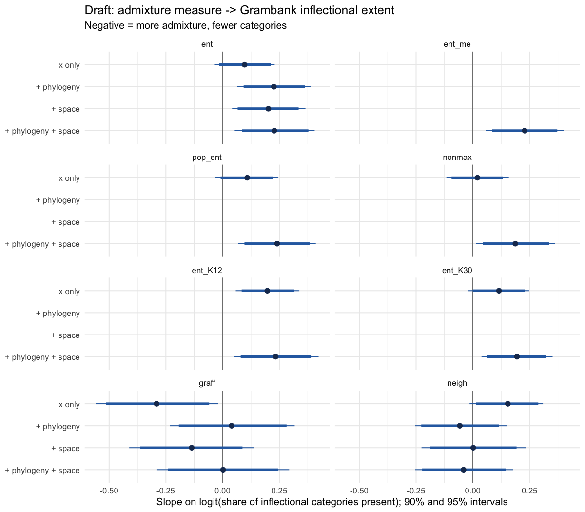
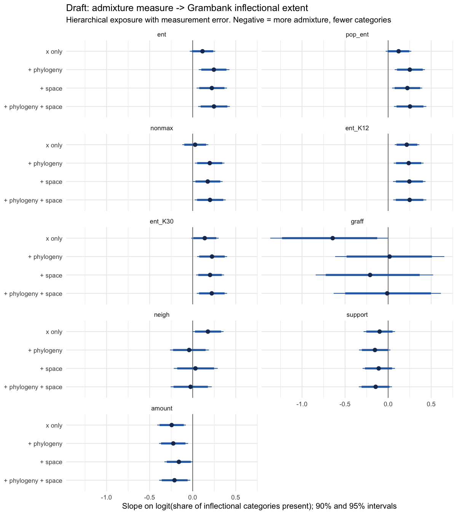

# Draft model: genetic admixture → Grambank inflectional extent (2026-10-10)

**Exploratory draft, on the user's request.** This folder lifts the pipeline's ancestry
firewall for itself only. All non-proxy GeLaTo links are treated as correct for now
(none is confirmed yet). Nothing here is a confirmatory test: the admixture values have
now been seen, so any later pre-specified analysis is no longer blind to them.

Files:

| File | Content |
|---|---|
| `prepare.py` | builds `language_data.csv`, `admixture_by_K.csv`, `phylo_tree.nwk`, `prep_summary.json` |
| `fit_models.R` | fits all models (brms 2.23, cmdstanr, CmdStan 2.38); writes `model_results_raw.csv`, `loo_x_vs_baseline.csv`, `loo_controls.csv`; fits cached in `fits/` (not for git) |

Run: `.venv/bin/python analyses/draft_admixture_model_2026_10_10/prepare.py`, then
`Rscript analyses/draft_admixture_model_2026_10_10/fit_models.R` (about 45 min on 16 cores).

## 1. Data

* **Languages:** the 175 of the typology main set (pcfp_v2: non-proxy GeLaTo link, Grambank
  entry, ≥ 8 of 12 categories coded). All 175 have ADMIXTURE data. 49 families.
* **Outcome:** `n_present` of `n_coded` inflectional categories (12-category set).
  Missing categories are handled by the binomial denominator, not by rescaling: a language
  with 8 coded categories contributes 8 trials.
* **Populations → language:** all non-proxy links (exact, dialect roll-up, group
  map-down). 1–121 individuals per language (median 10), 1–15 populations (median 1).

## 2. Admixture measures

ADMIXTURE best runs of Graff et al. 2025 (Human Origins, 4,768 individuals, K = 12…30).

| Measure | Definition | Note |
|---|---|---|
| `ent` (primary) | Shannon entropy of each **individual's** ancestry proportions, averaged over K = 12–30, then over all individuals of the language | reference-free "ancestry diversity" |
| `nonmax` | 1 − largest component, per individual, same averaging | |
| `pop_ent` | entropy of each **population's** mean ancestry, averaged over K, then over the language's populations | includes between-individual heterogeneity |
| `ent_K12`, `ent_K30` | `ent` at a single K | K sensitivity |
| `graff` | 1 if a population of the language is a curated admixture **target** in Graff et al. Table S2 (or the language is the GBI target), else 0 | admixture from a *different family*, literature-curated; 59 of 175 |
| `neigh` | −log median FST to populations within 1,000 km (GeLaTo main panel; drifted populations excluded) | gene flow with neighbours; 124 languages |

`ent`, `nonmax` and `pop_ent` are nearly the same measure (Spearman 0.94–0.99).
`graff` is unrelated to them (ρ ≈ 0.06); `neigh` is unrelated to the entropy measures
(ρ ≈ 0.03) and negatively related to `graff` (ρ = −0.32).

## 3. Model

```
n_present | trials(n_coded) ~ 1 + x  [+ (1 | gr(lang, cov = A))]  [+ gp(sx, sy, sz)]
family = beta_binomial (logit mean, precision phi)
```

* **x:** the admixture measure, standardised (z); `graff` centred 0/1.
* **Phylogeny:** Glottolog classification of the 175 languages from `low`
  (languages-of-the-world; 164 languages) or Glottolog 5.3 (11 not in `low`); Grafen
  branch lengths; correlation matrix `A`. Families are independent.
* **Space:** exact Gaussian process on each language's Glottolog point coordinate,
  converted to 3-D unit-sphere coordinates (chordal distance; no break at 180°).
* **Priors:** intercept N(0, 1.5); slope N(0, 0.5) per SD; phylogenetic SD and GP SD
  Exp(1); GP length scale brms default; phi Gamma(2, 0.1).
* **Model set per measure:** N (x only), P (+ phylogeny), S (+ space), F (+ both); the
  same four without x as baselines (refitted on the 124 languages for `neigh`).
* **Comparison:** PSIS-LOO; Δelpd = elpd(with x) − elpd(baseline with the same controls).
* **Measurement error (one sensitivity):** `ent` with `me()`, standard error of the
  language mean over individuals (pooled SD where fewer than 3 individuals).

## 4. Compromises in this draft

1. **Links taken as correct.** No link is confirmed; some are wrong (e.g. the Scottish
   regional populations linked to Scottish Gaelic).
2. **Language-level averaging.** Individual measures are averaged over all individuals of
   a language, so populations with more individuals weigh more; no hierarchical
   individual → population → language model. The `me()` fit is a partial substitute.
3. **K handling.** Measures are averaged over K = 12–30 rather than modelled per K; the
   K = 12 and K = 30 fits bracket the choice.
4. **Phylogeny is a topology.** Glottolog has no branch lengths; Grafen's lengths depend
   on clade size, not time. Families are independent, which ignores deep relations and
   gives isolates no phylogenetic signal.
5. **Space is one point per language.** Large or dispersed languages get one coordinate;
   the GP has one global length scale.
6. **Entropy is reference-free.** It cannot tell admixture from position on a genetic
   cline, and it depends on which populations are in the ADMIXTURE panel (densely sampled
   regions get their own components).
7. **No time depth.** Old and recent admixture count the same.
8. **LOO.** Several observations have Pareto k > 0.7 in models with a per-language random
   effect, so the Δelpd values are approximate (K-fold CV would be the fix).

## 5. Results



### 5.1 Controls

PSIS-LOO of the baselines (no admixture term):

| Controls | Δelpd vs best (SE), 175 languages | Δelpd vs best (SE), 124 languages |
|---|---|---|
| phylogeny | 0 | 0 |
| phylogeny + space | −0.1 (1.6) | −1.1 (1.1) |
| space only | −8.9 (7.1) | −8.9 (5.3) |
| none | −59.5 (9.1) | −40.0 (9.1) |

Phylogeny carries almost all the structure. Space adds nothing once phylogeny is in, and
alone it fits clearly worse. So geography and phylogeny are largely collinear here, and
the Glottolog tree absorbs the geographic signal (most families are spatially compact).

### 5.2 Admixture slopes

Slope on the logit scale, per SD of the measure (`graff`: target vs not). Δelpd: gain
from adding the measure to the baseline with the same controls.

| Measure | x only | + phylogeny | + space | + both | Δelpd (+ both) |
|---|---|---|---|---|---|
| `ent` | 0.10 [−0.04, 0.23] | **0.23 [0.07, 0.39]** | **0.20 [0.04, 0.37]** | **0.23 [0.05, 0.41]** | +3.0 (1.9) |
| `ent`, measurement error | | | | **0.23 [0.06, 0.40]** | +2.4 (2.0) |
| `pop_ent` | 0.11 [−0.03, 0.24] | | | **0.24 [0.07, 0.41]** | +3.2 (2.2) |
| `nonmax` | 0.02 [−0.12, 0.16] | | | **0.19 [0.01, 0.36]** | +2.1 (1.7) |
| `ent`, K = 12 | **0.20 [0.06, 0.34]** | | | **0.23 [0.05, 0.42]** | +2.5 (1.9) |
| `ent`, K = 30 | 0.12 [−0.02, 0.25] | | | **0.19 [0.04, 0.35]** | +1.4 (1.8) |
| `graff` | **−0.29 [−0.56, −0.02]** | 0.04 [−0.23, 0.32] | −0.14 [−0.41, 0.14] | 0.00 [−0.29, 0.29] | −1.0 (0.5) |
| `neigh` (124) | 0.15 [−0.01, 0.31] | −0.06 [−0.25, 0.15] | 0.00 [−0.23, 0.23] | −0.04 [−0.25, 0.18] | −0.7 (0.6) |

Diagnostics:
* All fits have R-hat ≤ 1.015 and at most 3 divergent transitions, after stricter
  adaptation for the "+ both" models.
* The exception is the measurement-error fit: R-hat 1.033 and bulk ESS 122 (usable for a
  draft, not more).
* 0–9 observations per model have Pareto k > 0.7.

### 5.3 Reading

1. **No support for "more admixture → less inflection".** No measure has a negative
   slope once phylogeny is controlled.
2. **The entropy measures go the other way.** With phylogeny, about +0.23 logit per SD
   of ancestry entropy: roughly +0.6 of 12 categories per SD at the mean share. All three
   variants and both ends of the K range agree, and so does the measurement-error fit.
   * The predictive gain is small (Δelpd ≈ +2 to +3, SE ≈ 2).
   * Raw, without controls, the slope is near zero. It appears once families are compared
     internally: within-family Spearman 0.19 over 122 languages in families of ≥ 4. The
     largest within-family correlations are Turkic (0.68, n = 12) and Austronesian
     (0.26, n = 36).
   * Likely sources, not yet separated:
     * Entropy is high where genetic clines and panel structure put populations
       between components: Central Asia (Turkic, Mongolic) and Island Melanesia. That is
       not necessarily contact with adult L2 learners.
     * Inside Austronesian, the high-entropy Melanesian languages may differ in
       inflection for other reasons, such as Papuan substrate (contact that *adds*
       morphology).
3. **The Graff et al. curated targets:** −0.29 raw, because targets are over-represented
   among the low-inflection languages. The effect is gone with phylogeny (0.00), so it was
   a family composition effect.
4. **Gene flow with neighbours (FST):** nothing after controls.

**In one line:** in this draft, admixture as measured by ADMIXTURE entropy is weakly
*positively* associated with inflectional breadth after phylogenetic control, and the
other measures show nothing. Since the measure, the links and the outcome are all still
rough, this is a description of the draft, not a finding.

## 6. Next steps this draft points to

* Check which languages drive the entropy slope: leave-one-family-out refits, and a
  posterior plot of residuals by region.
* Replace the language-level averages with a hierarchical individual → population →
  language exposure model.
* Use K-fold cross-validation instead of PSIS-LOO for the model comparison.
* A source-specific measure (f3 or qpAdm) for a subset of well-understood cases, to see
  whether entropy tracks known admixture events.
* Redo the analysis after the link review, and with the hand-coded Grambank gaps.

## 7. Hierarchical exposure model (2026-10-10, `fit_hier.R`)

User request: replace the language-level averages with an individual → population →
language model, refit all measures, use higher adapt_delta, 3,000 iterations, and brms
threading (CmdStan rebuilt for the current macOS; 4 chains × 2 threads, 2 fits at a time).
Outputs: `hier_exposure.csv`, `hier_stage1_diagnostics.csv`, `hier_model_results.csv`,
`hier_loo_x_vs_baseline.csv`, `hier_loo_controls.csv`, `slopes_hier.png`. Total run time
about 65 min.

### 7.1 Design (two stages, "cut")

**Stage 1, exposure.** One model per measure, on a unit scale:

| Measure level | Model | Measures |
|---|---|---|
| individual | `value_i ~ 1 + (1 \| lang) + (1 \| lang:population)`, Gaussian | `ent`, `nonmax`, `ent_K12`, `ent_K30` (2,598 individuals, 294 populations) |
| population | `value_p ~ 1 + (1 \| lang)`, Gaussian | `pop_ent`, `support`, `amount`, `neigh` (201 populations, 124 languages) |
| population | `target_p ~ 1 + (1 \| lang)`, Bernoulli | `graff` (curated target population or not) |

The language exposure is η_l = Intercept + r_lang[l], summarised by its posterior mean
and SD. A language known from few individuals or one population therefore gets a wide
η_l, pulled toward the overall mean; several populations combine through the population
level instead of being pooled.

**Stage 2, outcome.** As in §3, with `me(x, x_sd)`: x = η_l standardised over languages,
x_sd its posterior SD on the same scale. Control sets N, P, S and F for every measure;
adapt_delta 0.99 (0.995 for F), 3,000 iterations (1,500 warmup).

The stages are fitted separately, so the outcome cannot shape the exposure estimates.
The cost is that stage 2 sees each η_l as a normal distribution.

### 7.2 Stage 1 results

* All exposure models converged: R-hat ≤ 1.009 and no divergences.
* **Where the variation lies** (`ent`, SD in standardised units):
  * between languages 0.91;
  * between populations of a language 0.27;
  * between individuals of a population 0.28.

  Populations of one language are much more alike than different languages are, so the
  language-level exposure is well defined.
* **Exposure uncertainty** (median posterior SD relative to the spread of language
  means):

  | Measure | Ratio |
  |---|---|
  | `ent_K12` | 0.23 |
  | `ent`, `nonmax`, `pop_ent` | 0.31–0.33 |
  | `neigh` | 0.38 |
  | `amount`, `ent_K30` | 0.42–0.43 |
  | `support` | 0.56 |
  | `graff` | 1.05 |

  The `graff` exposure is barely identified at language level: most languages have one
  population, so a binary flag carries little information about a language-level rate.

### 7.3 Stage 2 results



Controls (baselines): phylogeny alone is best; + space −0.6 (1.8); space alone −9.6 (7.2);
none −60.0 (9.2). This is the same as §5.1.

Slope with phylogeny + space (95% interval) and Δelpd against the same baseline:

| Measure | Slope (F) | P(slope < 0) | Δelpd (F) |
|---|---|---|---|
| `ent` | +0.25 [0.06, 0.43] | 0.005 | −0.1 (2.3) |
| `pop_ent` | +0.25 [0.07, 0.44] | 0.004 | −0.0 (2.4) |
| `nonmax` | +0.20 [0.02, 0.38] | 0.015 | +0.2 (1.9) |
| `ent_K12` | +0.25 [0.06, 0.44] | 0.004 | +0.1 (2.1) |
| `ent_K30` | +0.22 [0.05, 0.40] | 0.007 | −2.9 (2.3) |
| `support` | −0.15 [−0.34, 0.04] | 0.93 | −4.4 (2.2) |
| `amount` | −0.21 [−0.39, −0.03] | 0.99 | −3.0 (3.3) |
| `graff` | −0.01 [−0.63, 0.61] | 0.53 | not valid (see below) |
| `neigh` (124) | −0.03 [−0.26, 0.22] | 0.58 | −1.3 (0.6) |

Diagnostics:
* All 44 outcome fits have R-hat ≤ 1.016, at most 6 divergent transitions, and bulk
  ESS ≥ 333.
* **`graff` LOO is invalid.** 169–171 of 175 observations have Pareto k > 0.7. With an
  almost unidentified latent exposure per language, each observation largely determines
  its own latent value, so leaving it out is not approximated by PSIS. Its elpd values
  must be ignored; the slope is usable.

### 7.4 Reading

1. **The slopes are robust to the hierarchical exposure model.** They barely change from
   §5.2: the entropy family stays at +0.20 to +0.25 with intervals above 0.
2. **The predictive gain disappears.** Once exposure uncertainty is carried through, no
   measure improves out-of-sample prediction over phylogeny alone (Δelpd within ±1 SE of
   0, or negative).
   * Of the entropy measures, only K = 12 entropy gains anything without controls:
     +2.8 (2.6).
   * The positive entropy association is therefore a consistent but small parameter
     estimate that does not help predict inflection.
3. **The Graff et al. two-way measures point the other way.**
   * `amount` (share of the second ancestry, where a population looks like a clean
     two-way mix): −0.21 [−0.39, −0.03].
   * `support`: −0.15 [−0.34, 0.04].

   This is the hypothesised direction, but both make prediction worse (Δelpd −3.0 and
   −4.4). These measures correlate negatively with entropy (`support` −0.52, `amount`
   −0.18), so "clean two-way admixture" and "generic ancestry diversity" are different
   things here.
4. **The curated-target indicator and neighbour FST show nothing** after phylogenetic
   control.

**In one line:** the draft's admixture–inflection associations are small, change sign
depending on what the measure captures, and add no predictive value over phylogeny. The
outcome is driven by family history, and none of the current genetic measures picks up a
robust contact signal.
