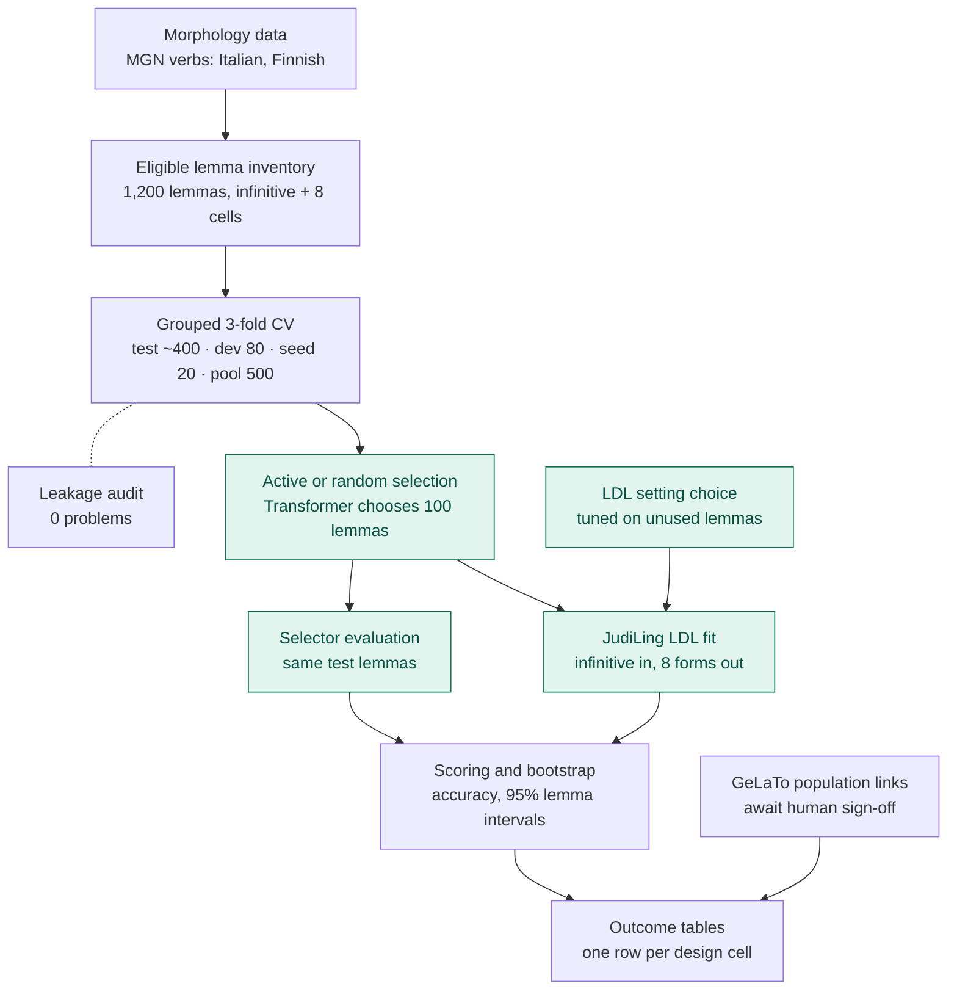

# Pipeline overview (pilot_v1)

High-level map of the stages; details in [PROTOCOL.md](PROTOCOL.md), results in
[REPORT.md](REPORT.md).

Teal boxes are stages where models are fitted.

| Stage | What is fitted | Count in pilot_v1 |
|---|---|---|
| LDL setting choice | JudiLing on 100 auxiliary lemmas, scored on 80 others; grid cue n-gram {2,3} × inflection SD {0.4, 4.0} | 8 (4 settings × 2 languages) |
| Selection | Character Transformer, retrained from scratch at 20, 40, 60, 80, 100 lemmas | 24 runs (2 languages × 3 folds × 4 policy/pool settings), 5 trainings each |
| LDL fit | JudiLing end-state model on the 100 selected lemmas | 24 |
| Selector evaluation | Final selector of each run, scored on the same test lemmas | 24 |
