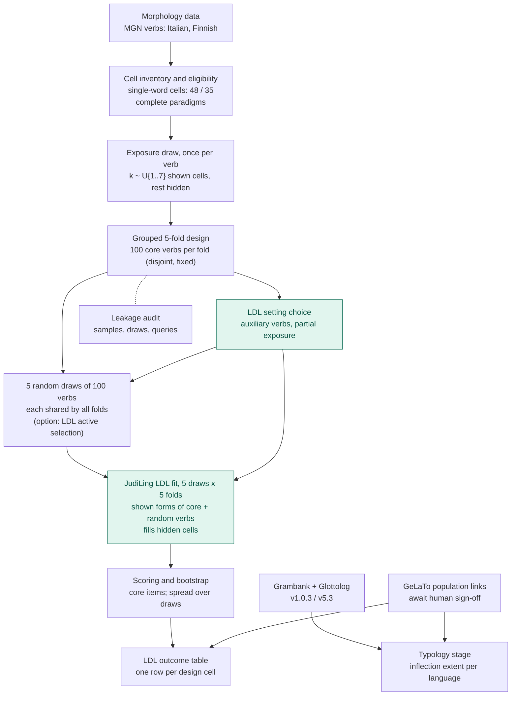

# Pipeline overview (pcfp_v2; pcfp_v1 design kept as an option)

High-level map of the stages; details in [PROTOCOL.md](PROTOCOL.md), results in
[REPORT_pcfp_v1.md](REPORT_pcfp_v1.md) (active vs random selection) and
[REPORT_pcfp_v2.md](REPORT_pcfp_v2.md) (repeated random draws, the default design). The pilot_v1 pipeline (source-known new verbs,
Transformer selector) is described in [REPORT.md](REPORT.md) and preserved at commit
24390cf.

Teal boxes are stages where models are fitted. The LDL outcome (inflecting languages
only) and the Grambank outcome (all GeLaTo-linked languages in Grambank) join on the
language-level Glottocode.

| Stage | What is fitted | Count in pcfp_v2 (default) | Count in pcfp_v1 |
|---|---|---|---|
| LDL setting choice | JudiLing on the shown forms of 200 auxiliary verbs, scored on the hidden cells of 100 of them; grid cue n-gram {2,3} × inflection SD {0.4,1,2,4} | 16 (8 settings × 2 languages) | 16 |
| Selection | pcfp_v2: none (random draws). pcfp_v1: LDL selector refitted every round (3 semantic seeds), each pool candidate scored via a rank-one citation row | 0 | 18 active runs × 4 rounds × 3 seeds; 6 random runs (no model) |
| LDL fit | JudiLing end-state model on 100 core + 100 extra verbs | 50 (5 draws × 5 folds × 2 languages) | 24 |
| Typology | none (counts only) | – | – |
